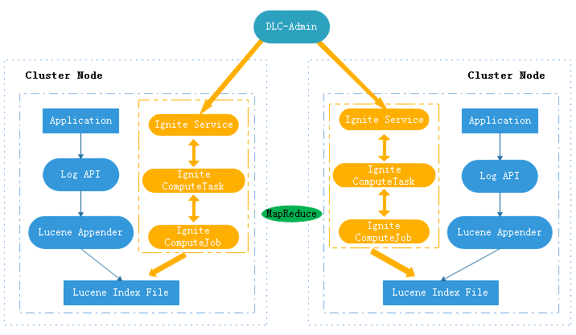
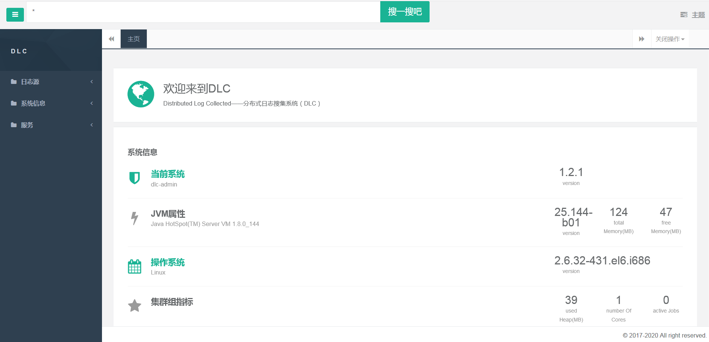
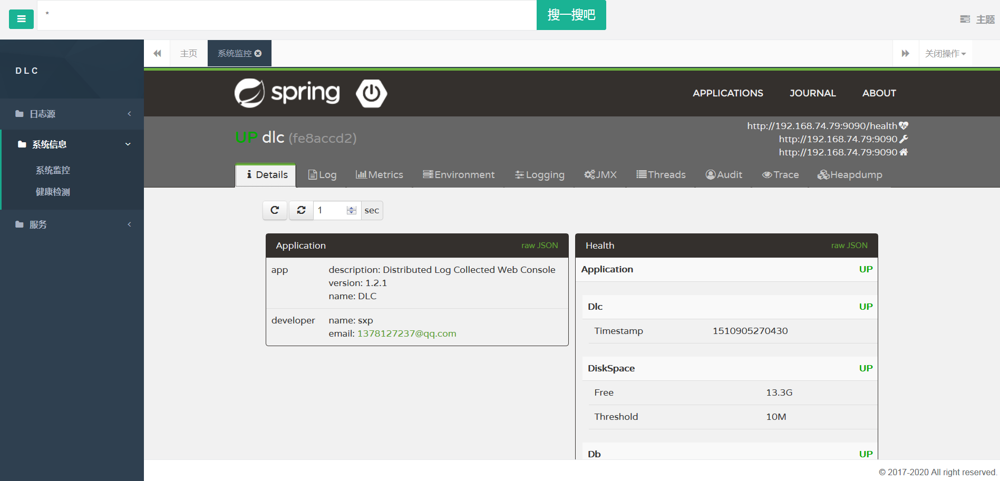
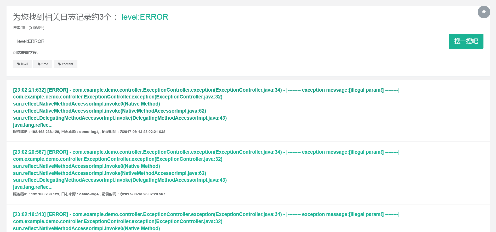

# dlc
[](https://travis-ci.org/xiapshen/dlc) [](https://www.apache.org/licenses/LICENSE-2.0.html)

Distributed Log Collected——分布式日志搜集系统（DLC）

目前只支持log4j版本的日志搜集，对logback等暂不兼容

## 1.背景
日志是记录应用内部行为的工具，如果要查看日志，就得登录该服务器进行实地查看。这样如果应用以集群的方式进行部署，然后又不知道问题出现在哪台服务器，这时就需要登录每一台服务器，这给系统的开发、测试和运维带来了很多的麻烦。
所以急切需要一个系统能够将集群中的所有日志统一搜集，并在客户端统一展示，降低运维或者测试成本。

## 2.目标

问题是比较明确的，需求也比较清晰，就是希望能设计一套解决方案解决这个问题，大致整理一下，应该包括如下技术点：

> *   对应用透明：对应用的开发者而言，还是像原来那样记录日志，不需要关注日志是如何记录、以什么形式保存在哪里的；
> *   有相当的灵活性：希望是可以灵活配置的，除了可以按照关键字查询外，最好还可以灵活地自定义其他的维度，方便根据具体的业务场景，进行有针对性的查询，比如按照时间段进行查询，按照具体的业务指标进行查询等；
> *   有统一的查询界面：通过一个统一的界面，能够查询到整个集群范围内的日志，比如输入某个关键词，无需关注日志保存在哪台服务器上；
> *   有较高的性能：保证有较高的查询速度；
> *   部署简单：不需要复杂的配置，部署简单。

## 3.架构设计


## 4.优点
     
> *   资源占用少：日志的记录过程，和常规日志的记录没多大区别，没有额外的CPU和内存占用，唯一有较大消耗的，是Lucene的索引文件需要占用磁盘空间，如果对占用磁盘空间敏感，或者对日志的长期保存没有严格要求，可以设定索引过期时间，超期的索引会被删除；
> *   部署简单：客户端采用web应用闭环，直接上传到服务器，运行bin目录下脚本即可运行；
> *   灵活性强：可以根据需要，在日志配置文件中进行灵活的配置，可以配置记录哪些项目，什么格式等；
> *   自动建立集群：dlc-core模块和用户应用集成，应用启动过程中通过TCP检测自动发现并建立集群

## 5. dlc管理平台
### 5.1 搜索首页


### 5.2 系统监控


### 5.3 搜索结果


## 6.文档 ## demo
> *  gitbooks-io：link to [dlc.io](https://dlc.gitbooks.io/dlc-user-book/content/)
> *  demo：link to [dlc-demo](https://github.com/xiapshen/dlc/tree/master/exmple)

## 7.FAQ
1、如果项目中使用的h2为其他版本，ignite无法启动，如何解决？

答：修改h2 jar为1.4.191版本
```
<dependency>
     <groupId>com.h2database</groupId>
     <artifactId>h2</artifactId>
     <version>1.4.191</version>
</dependency>
```
